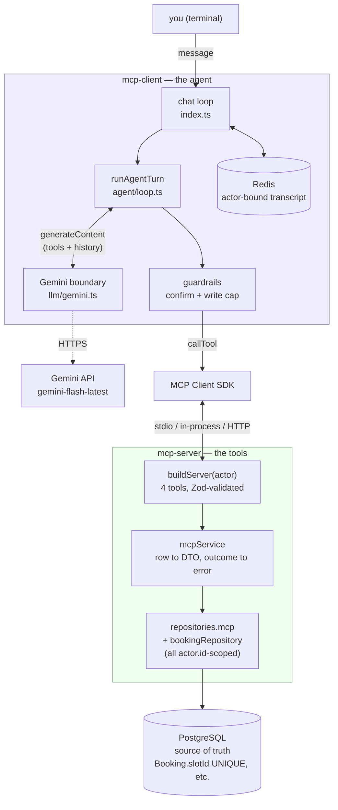

# MCP Booking Agent

A four-week extension to the platform: an LLM agent that **completes bookings**,
not just drafts them. It is a standalone
[Model Context Protocol](https://modelcontextprotocol.io) server exposing the
booking workflow as four tools, plus a Gemini-powered client that calls them in
a loop.

The platform already had a Claude assistant (Milestone 14) that turned a
plain-English request into a structured _draft_ and handed off to the normal
booking form — it never touched the database. This project closes that last
step: the agent runs `checkAvailability → createBooking` end to end, against the
real database, through the same repository layer and transaction the REST API
uses.

- **`mcp-server/`** (`@aisbp/mcp-server`) — the four tools over MCP; stdio and
  Streamable HTTP transports; one customer per process, resolved at startup.
- **`mcp-client/`** (`@aisbp/mcp-client`) — the agent loop, a Gemini boundary
  with a scripted fake for CI, three transports, write guardrails, and
  Redis-backed conversation state.

---

## Architecture



**Why it's shaped this way:**

- **The client owns the conversation; the server is stateless.** A transcript is
  a client concern. The server holds no per-conversation state, so a restart is
  invisible and the HTTP transport can be truly stateless (a fresh transport per
  request).
- **One actor per process, fixed at startup.** `AISBP_MCP_ACTOR_EMAIL` →
  `resolveActor` → an `Actor` threaded into every write tool, which scopes every
  query to `actor.id`. Nothing the model says can reach another customer's data.
- **The server is the authority.** The model supplies _intent_; the tool
  handlers re-validate with Zod, re-ground against real rows, enforce the state
  machine, and take the price snapshot from the DB. A hallucinated slot id comes
  back as `NOT_FOUND` and the model recovers — the client never enforces
  business rules, so there is no logic to drift out of sync.
- **The LLM sits behind an interface.** `LlmClient` with a `scriptedLlmClient`
  fake; CI drives the whole loop against the real server and DB without ever
  calling Gemini. One gated live check (`verify:gemini`) covers the real API.

Deeper dive on the security model: **[mcp-agent-security.md](mcp-agent-security.md)**.

---

## The metric — AI that _suggests_ → AI that _acts_

|                          | Milestone 14 assistant                        | MCP booking agent                                         |
| ------------------------ | --------------------------------------------- | --------------------------------------------------------- |
| Bookings it can create   | **0** (draft only; hands off to the web form) | **the booking, end to end**                               |
| Steps for the customer   | assistant → review page → manual confirm      | one conversation                                          |
| DB writes by the AI path | none (by design)                              | `createBooking` in the same transaction the REST API uses |

**Measured** (live, `gemini-flash-latest` → `gemini-3.8-flash`, seeded DB,
2026-09-09): _"Book me a washing machine installation on 2028-02-01."_ →
a `pending` booking row in **3 model turns** (`checkAvailability` →
`createBooking` → confirmation), ~16 s of model latency, ~5.4 k input / ~130
output tokens total.

**How confident is that number?** It's one run of one phrasing on the free tier.
The _shape_ is stable across ~15 live runs during development (2–4 turns for a
clear request; more when the model sweeps a date range one day at a time — a
known rough edge). The latency is dominated by the model, not the tools —
`checkAvailability` against the seeded DB is sub-millisecond. It is a
demonstration number, not a benchmark.

---

## Demo

```console
$ pnpm --filter @aisbp/mcp-client chat

you › What washing machine installation slots are open on 2028-02-01?
  → checkAvailability({"date":"2028-02-01","serviceType":"washing-machine-installation"})
  ← checkAvailability ok: { … "slotCount": 3, … }
bot › On February 1, 2028, there are three open slots for washing machine
      installation with technician Tomas Field: 10:00 AM–12:00 PM,
      1:00 PM–3:00 PM, and 4:00 PM–6:00 PM UTC.

you › Book the earliest one.
  → createBooking({"slot":"w4demo-0","serviceType":"washing-machine-installation"})
  ← createBooking ok: { "bookingId": "cmtufg3wc…", "status": "pending", … }
bot › Your washing machine installation has been booked for February 1, 2028,
      from 10:00 AM to 12:00 PM UTC with Tomas Field. Your booking ID is
      cmtufg3wc….
```

The `→` / `←` lines are the tool-call trace (stderr); the `bot ›` lines are the
model's replies (stdout). "The earliest one" in the second turn resolves against
the first turn's results — that context is the conversation state.

Record the GIF from a real session with **[`docs/mcp-demo.tape`](mcp-demo.tape)**
(`vhs docs/mcp-demo.tape`), or run the offline version with
`pnpm --filter @aisbp/mcp-client chat -- --scripted` (no API key).

---

## Prototype vs production-ready — be specific

**Production-shaped (I'd defend these in a review):**

- Every tool goes through `@aisbp/database` repositories and the same booking
  transaction + `Booking.slotId` UNIQUE double-booking guard the REST API uses.
- Actor scoping is enforced server-side and covered by adversarial tests (a
  scripted "compromised model" cannot read or change another customer's
  booking).
- One error contract; the LLM behind an interface with a CI-safe fake; 100+
  tests across the two packages; a gated live check.
- Write tools are confirmed and capped; the threat model is written down.

**Still a prototype:**

- **Single actor per process.** No per-request identity / token auth — the
  process _is_ the customer. Multi-tenant HTTP needs a bearer token resolved to
  an `Actor` per call. This is the biggest gap.
- **stdio/in-memory transports run the DB in the client process.** Fine for a
  CLI; a real deployment would only use HTTP.
- **No `checkAvailabilityRange` tool**, so a range request costs one model call
  per day — chatty and free-tier-limit-sensitive.
- **Conversation TTL / eviction is a single sliding expiry**, no size cap on a
  transcript.
- **`@google/genai` and `@modelcontextprotocol/sdk` are pinned exact** and
  bumped by hand.

## If I had two more weeks

1. **Per-request auth on the HTTP transport** — a signed token → `resolveActor`
   per call, `Actor` threaded through `callTool`. Removes the single-actor
   limitation and makes the HTTP server genuinely multi-tenant.
2. **A `checkAvailabilityRange` tool** — one call for "next two weeks" instead of
   fourteen. Cuts the token cost and the free-tier-limit exposure of the most
   common request by ~10×.
3. **Structured tool-call evals** — a fixed set of prompts run against the real
   model in CI (nightly, not per-PR), asserting the model picks the right tool
   and recovers from errors, so "tool-selection reliability" is a tracked number
   instead of a vibe.

## The hardest bug

`thoughtSignature`. The first real end-to-end run — the Week 2 Pride Gate —
worked for one turn and then returned HTTP 400 on the second:
_"Function call is missing a thought_signature."_ Gemini 3.x attaches an opaque
signature to each function call and rejects the _next_ request if it is not
echoed back. The offline mock suite (32 tests at the time) couldn't catch it —
it is a live-API contract, and the affected model IDs postdate the code's
knowledge cutoff. The fix was to stop using the SDK's `functionCalls` getter and
parse `response.candidates[0].content.parts` directly, so each call could be
paired with its signature and re-emitted. It is why `verify:gemini` and one real
run are now part of the definition of done, not an optional extra. Full writeup:
[mcp-agent-security.md §4.1](mcp-agent-security.md).

---

## Build log

| Week    | PR                                                                     | Delivered                                                                                    |
| ------- | ---------------------------------------------------------------------- | -------------------------------------------------------------------------------------------- |
| 1       | [#1](https://github.com/Sumit-0610/ai-service-booking-platform/pull/1) | `mcp-server`, 4 tools, stdio, actor-scoped auth, one error envelope, concurrency tests       |
| 2       | [#2](https://github.com/Sumit-0610/ai-service-booking-platform/pull/2) | `mcp-client` Gemini agent CLI, the loop, 3 transports, stateless Streamable HTTP transport   |
| 2 (fix) | [#3](https://github.com/Sumit-0610/ai-service-booking-platform/pull/3) | Gemini 3.x fixes found by the first live run (`thoughtSignature`, prompt date)               |
| 3       | [#4](https://github.com/Sumit-0610/ai-service-booking-platform/pull/4) | Write guardrails, Redis conversation state, [`mcp-agent-security.md`](mcp-agent-security.md) |
| 4       | —                                                                      | this doc, the diagram, the metric, the demo tape, README integration                         |
